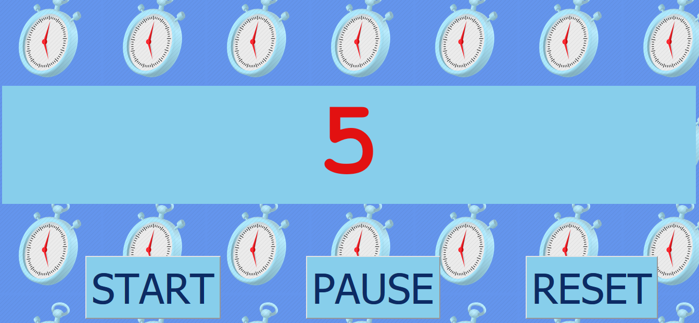

# Stopwatch

###### April 2020

_This is the first time I made anything involving a counter / clock_

### Things I learnt / experimented with in this project:

- Using setTimeout and clearTimeout
- Creating a variable which counts up in number
- Learning more about how to use DOM methods and properties

## Built with:

- HTML
- CSS
- JavaScript

## Getting Started:

Clone the repo as instructed below

## Prerequisites:

No prerequisites

## Installation

1.  Clone the repo

`git clone https://github.com/katiehawcutt/basic-stopwatch.git`

2. Run the index.html in a browser

## Usage

Press start to start the stopwatch. Then pause or reset as desired!
